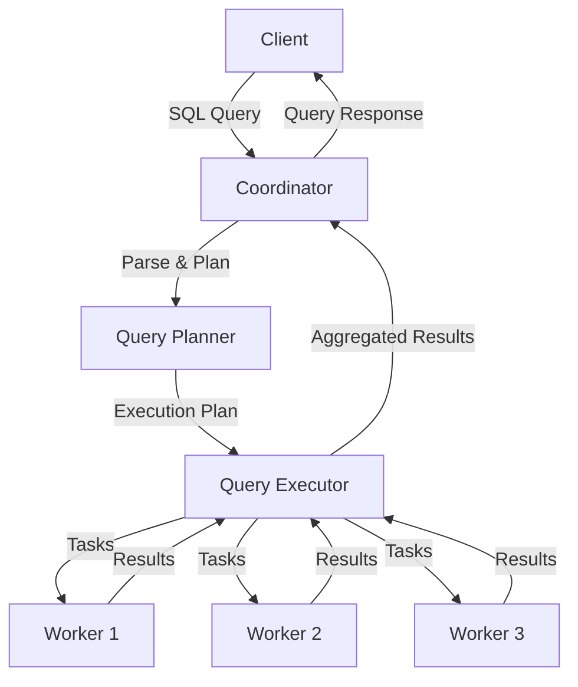

# Distributed SQL Query Engine

This project demonstrates the internal workings of a simplified distributed SQL engine built in Java. It simulates how distributed databases like Presto, SparkSQL, or Snowflake process queries across multiple worker nodes.

## 🏗️ Architecture

The system consists of three main components:

- **Coordinator**: Parses SQL queries, creates execution plans, and coordinates task execution across workers
- **Worker Nodes**: Execute query plan nodes on partitioned data and return results
- **Client**: CLI interface for submitting queries and viewing results



## ✨ Features

- **gRPC-based Architecture**: High-performance RPC communication between components
- **SQL Query Support**: 
  - SELECT queries with column projection
  - WHERE conditions with basic operators (=, !=, >, <, >=, <=)
  - INNER JOIN operations between tables
- **Distributed Execution**: Parallel query processing across multiple worker nodes
- **Data Partitioning**: Simulated data distribution across workers
- **Fault Tolerance**: 
  - Checkpointing of partial results
  - Retry logic for failed worker nodes
  - Simulated failure scenarios
- **Instrumentation & Tracing**: 
  - Query lifecycle tracking
  - Execution timing and performance metrics
  - Detailed logging and monitoring

## 🚀 Quick Start

### Prerequisites

- Java 17 or higher
- Maven 3.6 or higher

### Building the Project

```bash
# Clone the repository
git clone <repository-url>
cd distributed-sql-engine

# Build the project
mvn clean compile

# Generate protobuf classes
mvn protobuf:compile protobuf:compile-custom
```

### Running the System

1. **Start Worker Nodes** (in separate terminals):

```bash
# Worker 1
mvn exec:java -Dexec.mainClass="com.distributed.sql.worker.WorkerMain" -Dexec.args="worker1 50052"

# Worker 2  
mvn exec:java -Dexec.mainClass="com.distributed.sql.worker.WorkerMain" -Dexec.args="worker2 50053"

# Worker 3
mvn exec:java -Dexec.mainClass="com.distributed.sql.worker.WorkerMain" -Dexec.args="worker3 50054"
```

2. **Start Coordinator**:

```bash
mvn exec:java -Dexec.mainClass="com.distributed.sql.coordinator.CoordinatorMain" -Dexec.args="50051"
```

3. **Start Client**:

```bash
mvn exec:java -Dexec.mainClass="com.distributed.sql.client.SQLClient" -Dexec.args="localhost:50051"
```

## 📊 Example Queries

### Basic SELECT Queries

```sql
-- Select all users
SELECT * FROM users;

-- Select specific columns
SELECT name, age, city FROM users;

-- Filter users by age
SELECT name, age FROM users WHERE age > 30;

-- Multiple conditions
SELECT name, salary FROM users WHERE age > 25 AND salary > 70000;
```

### JOIN Queries

```sql
-- Join users with their orders
SELECT u.name, o.product_name, o.price 
FROM users u 
JOIN orders o ON u.user_id = o.user_id;

-- Join with filtering
SELECT u.name, o.product_name 
FROM users u 
JOIN orders o ON u.user_id = o.user_id 
WHERE u.age > 30;
```

## 🔍 Query Execution Flow

1. **Query Submission**: Client sends SQL query to coordinator
2. **Parsing**: Coordinator parses SQL into structured Query object
3. **Planning**: Query planner creates execution plan tree
4. **Task Distribution**: Plan is broken into tasks for each worker
5. **Parallel Execution**: Workers execute tasks on partitioned data
6. **Result Aggregation**: Coordinator collects and merges results
7. **Response**: Final results returned to client

## 🛡️ Fault Tolerance

The system includes several fault tolerance mechanisms:

### Checkpointing
- Workers periodically save partial execution state
- Enables recovery from mid-execution failures
- Checkpoints include intermediate results and execution state

### Retry Logic
- Failed tasks are automatically retried on different workers
- Exponential backoff for retry attempts
- Graceful degradation when workers are unavailable

### Failure Simulation
- Configurable failure probability for testing
- Simulates network delays and worker failures
- Helps validate fault tolerance mechanisms

## 📈 Instrumentation & Monitoring

### Query Tracing
- Complete query lifecycle tracking
- Timing information for each execution phase
- JSON-formatted trace data for analysis

### Performance Metrics
- Execution time per worker
- Data processing statistics
- Network communication timing

### Logging
- Structured logging with SLF4J
- Query execution logs
- Worker status and health monitoring

## 🗂️ Project Structure

```
distributed-sql-engine/
├── coordinator/           # Coordinator components
│   ├── CoordinatorServer.java
│   ├── QueryPlanner.java
│   ├── QueryExecutor.java
│   └── SQLParser.java
├── worker/               # Worker node components
│   ├── WorkerServer.java
│   ├── ExecutionEngine.java
│   └── FaultToleranceManager.java
├── common/               # Shared models and protobuf
│   ├── models/          # Data models
│   └── proto/           # gRPC service definitions
├── client/               # CLI client
│   └── SQLClient.java
├── utils/                # Utilities
│   ├── Logger.java
│   └── Tracer.java
└── data/                 # Sample datasets
    ├── users.csv
    └── orders.csv
```

## 🎯 Educational Value

This project demonstrates key concepts in distributed systems:

- **Distributed Query Processing**: How queries are planned and executed across multiple nodes
- **gRPC Communication**: High-performance RPC patterns for microservices
- **Fault Tolerance**: Checkpointing, retries, and failure handling
- **Data Partitioning**: Strategies for distributing data across workers
- **Query Optimization**: Basic rule-based query planning
- **Instrumentation**: Monitoring and tracing in distributed systems

## 🔮 Future Enhancements

- **Cost-Based Optimizer**: Implement statistics-based query optimization
- **Advanced JOINs**: Support for hash joins and sort-merge joins
- **Aggregation**: GROUP BY and aggregate functions
- **Data Shuffling**: Implement shuffle operations for distributed joins
- **Caching**: Query result caching and materialized views
- **Security**: Authentication and authorization
- **Scalability**: Dynamic worker registration and load balancing

## 🤝 Contributing

This is an educational project designed to demonstrate distributed SQL concepts. Contributions that enhance the educational value or add new features are welcome!

## 📄 License

This project is licensed under the MIT License - see the LICENSE file for details.

---

**Note**: This is a simplified implementation for educational purposes. Production distributed SQL engines are significantly more complex and include many additional features for performance, reliability, and scalability.
