# 🎯 Interview Visualization Guide - Distributed SQL Query Engine

## 📋 Quick Interview Overview (30 seconds)

**"This is a Distributed SQL Query Engine that simulates how databases like Presto, SparkSQL, or Snowflake work. It demonstrates parallel query processing across multiple worker nodes using Rust, gRPC, and Cargo."**

---

## 🏗️ System Architecture Diagram

```mermaid
graph TB
    subgraph "Client Layer"
        CLI[🖥️ CLI Client<br/>SQL Interface<br/>Port: Interactive]
    end

    subgraph "Coordinator Layer (Port 50051)"
        CS[🎯 Coordinator Server<br/>gRPC Server]
        SP[📝 SQL Parser<br/>Regex-based<br/>Query → Object]
        QP[🧠 Query Planner<br/>Rule-based<br/>Object → Plan]
        QE[⚡ Query Executor<br/>Task Distribution<br/>Plan → Tasks]
    end

    subgraph "Worker Layer"
        W1[🔧 Worker 1<br/>Port: 50052<br/>Data Partition A]
        W2[🔧 Worker 2<br/>Port: 50053<br/>Data Partition B]
        W3[🔧 Worker 3<br/>Port: 50054<br/>Data Partition C]
    end

    CLI -->|"1️⃣ SQL Query"| CS
    CS -->|"2️⃣ Parse"| SP
    SP -->|"3️⃣ Query Object"| QP
    QP -->|"4️⃣ Execution Plan"| QE
    QE -->|"5️⃣ Tasks"| W1
    QE -->|"5️⃣ Tasks"| W2
    QE -->|"5️⃣ Tasks"| W3
    W1 -->|"6️⃣ Results"| QE
    W2 -->|"6️⃣ Results"| QE
    W3 -->|"6️⃣ Results"| QE
    QE -->|"7️⃣ Aggregated"| CS
    CS -->|"8️⃣ Response"| CLI
```



---

## 🔄 Query Execution Sequence

```mermaid
sequenceDiagram
    participant C as 🖥️ Client
    participant CS as 🎯 Coordinator
    participant SP as 📝 SQL Parser
    participant QP as 🧠 Query Planner
    participant QE as ⚡ Query Executor
    participant W1 as 🔧 Worker 1
    participant W2 as 🔧 Worker 2
    participant W3 as 🔧 Worker 3

    C->>CS: 1️⃣ Submit: "SELECT name FROM users WHERE age > 25"
    CS->>SP: 2️⃣ Parse SQL
    SP->>SP: 3️⃣ Extract: columns, tables, conditions
    SP->>QP: 4️⃣ Create Query Object
    QP->>QP: 5️⃣ Build Execution Plan Tree
    QP->>QE: 6️⃣ Execution Plan
    QE->>W1: 7️⃣ Execute SCAN tasks
    QE->>W2: 7️⃣ Execute FILTER tasks
    QE->>W3: 7️⃣ Execute PROJECT tasks
    W1->>QE: 8️⃣ Return partial results
    W2->>QE: 8️⃣ Return partial results
    W3->>QE: 8️⃣ Return partial results
    QE->>QE: 9️⃣ Aggregate results
    QE->>CS: 🔟 Final result set
    CS->>C: 1️⃣1️⃣ Return query response
```



---

## 🌳 Query Plan Tree Structure

```mermaid
graph TD
    subgraph "Query Plan Tree for: SELECT name FROM users WHERE age > 25"
        ROOT[🎯 PROJECT Node<br/>Select: name<br/>Worker: Random]
        FILTER[🔍 FILTER Node<br/>Condition: age > 25<br/>Worker: Random]
        SCAN[📊 SCAN Node<br/>Table: users<br/>Worker: Random]
    end

    ROOT --> FILTER
    FILTER --> SCAN

    style ROOT fill:#e1f5fe,stroke:#01579b,stroke-width:3px
    style FILTER fill:#f3e5f5,stroke:#4a148c,stroke-width:3px
    style SCAN fill:#e8f5e8,stroke:#1b5e20,stroke-width:3px
```



---

## 🧠 Technology Stack Mind Map

```mermaid
mindmap
  root((🚀 Distributed SQL Engine))
    🏗️ Architecture
      Microservices Design
      gRPC Communication
      Protocol Buffers
      Port-based Services
    📝 Query Processing
      SQL Parsing (Regex)
      Query Planning (Rule-based)
      Parallel Execution
      Result Aggregation
    🛡️ Fault Tolerance
      Checkpointing
      Retry Logic
      Failure Simulation
      Error Handling
    🧪 Testing
      Unit Tests (JUnit 5)
      Integration Tests
      End-to-End Tests
      Mock Services
    📊 Performance
      Parallel Processing
      Data Partitioning
      Instrumentation
      Monitoring & Logging
```



---

## 🎤 Interview Presentation Script

### **Opening (30 seconds)**

_"This is a Distributed SQL Query Engine that simulates how databases like Presto, SparkSQL, or Snowflake work. It demonstrates parallel query processing across multiple worker nodes using Rust, gRPC, and Cargo."_

### **Architecture Overview (60 seconds)**

_"The system has three main components:_

- _Client submits SQL queries_
- _Coordinator parses, plans, and orchestrates execution_
- _Workers execute tasks in parallel on partitioned data_

_Communication happens via gRPC for high performance."_

### **Query Lifecycle Demo (90 seconds)**

_"Let me walk you through a query execution:_

1. _Client submits: `SELECT name FROM users WHERE age > 25`_
2. _SQL Parser converts this to a structured Query object_
3. _Query Planner creates an execution plan tree:_
   - _SCAN node reads the users table_
   - _FILTER node applies the WHERE condition_
   - _PROJECT node selects the name column_
4. _Tasks are distributed to workers in parallel_
5. _Results are aggregated and returned to the client"_

### **Key Features Highlight (60 seconds)**

_"Key features include:_

- _gRPC-based architecture for high-performance communication_
- _Fault tolerance with checkpointing and retry logic_
- _Comprehensive testing with 80+ test cases_
- _Real-world patterns used in distributed systems_
- _Clean, maintainable code architecture"_

### **Technical Deep Dive (if asked)**

_"The implementation uses:_

- _Protocol Buffers for service definitions_
- _Rule-based query planning (not cost-based)_
- _Simple nested loop joins_
- _Memory-based checkpointing_
- _Structured logging with SLF4J"_

---

## 🎯 Key Talking Points

### **What Makes This Project Stand Out:**

1. **Real-world relevance** - Simulates actual distributed database systems
2. **Production technologies** - Uses gRPC, Protocol Buffers, Cargo
3. **Comprehensive testing** - 80+ test cases with unit and integration tests
4. **Clean architecture** - Separation of concerns, SOLID principles
5. **Fault tolerance** - Handles failures gracefully with retry logic

### **Technical Challenges Solved:**

1. **Query Planning** - Converting SQL to distributed execution plans
2. **Task Distribution** - Breaking work across multiple nodes
3. **Result Aggregation** - Combining partial results efficiently
4. **Fault Tolerance** - Handling worker failures gracefully
5. **Communication** - High-performance gRPC-based RPC

### **Learning Outcomes:**

1. **Distributed Systems** - Understanding of microservices architecture
2. **gRPC & RPC** - Service definition and communication patterns
3. **Data Processing** - Parallel execution and data partitioning
4. **Testing** - Comprehensive test strategy and implementation
5. **Monitoring** - Tracing, logging, and observability

---

## 🚀 Quick Demo Commands

### **Start the System:**

```bash
# Compile and run all components
./run_all.sh

# Or start individually:
# Terminal 1: Coordinator
cargo run --bin coordinator

# Terminal 2: Worker 1
cargo run --bin worker -- --worker-id worker1 --port 50052

# Terminal 3: Client
cargo run --bin client -- "SELECT name FROM users"
```

### **Sample Queries to Demo:**

```sql
-- Simple SELECT
SELECT name, age FROM users WHERE age > 25

-- JOIN query
SELECT u.name, o.product_name FROM users u JOIN orders o ON u.user_id = o.user_id

-- Complex WHERE conditions
SELECT name, salary FROM users WHERE age > 25 AND salary > 70000
```

### **Run Tests:**

```bash
# Run all tests
./run_tests.sh --all

# Run unit tests only
./run_tests.sh --unit

# Run with verbose output
./run_tests.sh --all --verbose
```

---

## 📊 Project Statistics

- **Lines of Code**: ~2,000+ lines
- **Test Coverage**: 80+ test cases
- **Components**: 3 main services (Coordinator, Workers, Client)
- **Technologies**: Rust, gRPC, Protocol Buffers, Cargo, Tokio
- **Architecture**: Microservices with gRPC communication
- **Features**: SQL parsing, query planning, parallel execution, fault tolerance

---

## 🎨 Visual Tools for Presentation

1. **Mermaid Live Editor**: https://mermaid.live/ (for interactive diagrams)
2. **Draw.io**: https://app.diagrams.net/ (for custom diagrams)
3. **VS Code**: With Mermaid preview extension
4. **GitHub**: Native Mermaid rendering in markdown

---

## 💡 Pro Tips for Interview Success

1. **Start with the big picture** - Show architecture first
2. **Use the sequence diagram** - Explain flow step-by-step
3. **Highlight testing** - Shows you care about code quality
4. **Mention real-world parallels** - Presto, SparkSQL, Snowflake
5. **Be ready to dive into code** - Know key classes and methods
6. **Show passion** - Explain why distributed systems are interesting
7. **Prepare for questions** - Know the trade-offs and limitations

---

## 🔍 Common Interview Questions & Answers

### **Q: Why did you choose gRPC over REST?**

**A:** _"gRPC provides better performance for inter-service communication with binary serialization, HTTP/2 multiplexing, and built-in code generation. It's ideal for microservices architectures like this distributed query engine."_

### **Q: How do you handle worker failures?**

**A:** _"The system implements checkpointing where workers save partial execution state. If a worker fails, tasks are retried on different workers. There's also retry logic with exponential backoff for network failures."_

### **Q: What are the limitations of your current implementation?**

**A:** _"It's a rule-based planner, not cost-based. Join algorithms are simple nested loops. Data partitioning is simulated, not real. But it demonstrates the core concepts and could be extended with more sophisticated algorithms."_

### **Q: How would you scale this system?**

**A:** _"Add dynamic worker registration, implement data shuffling for joins, add query result caching, implement cost-based optimization, and add proper data persistence instead of in-memory storage."_

---

_This visualization guide provides everything you need to present your Distributed SQL Query Engine project effectively in an interview setting!_ 🎯
